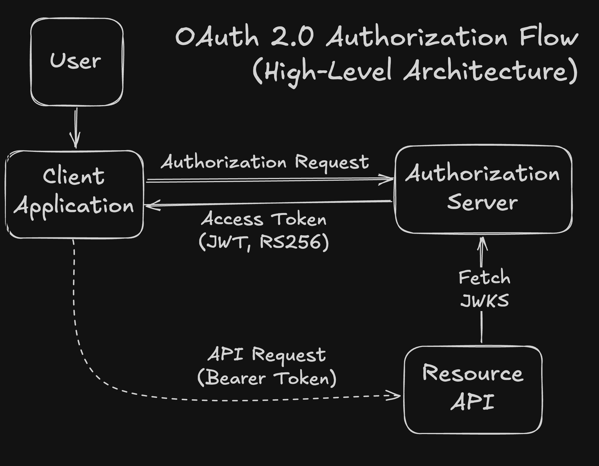
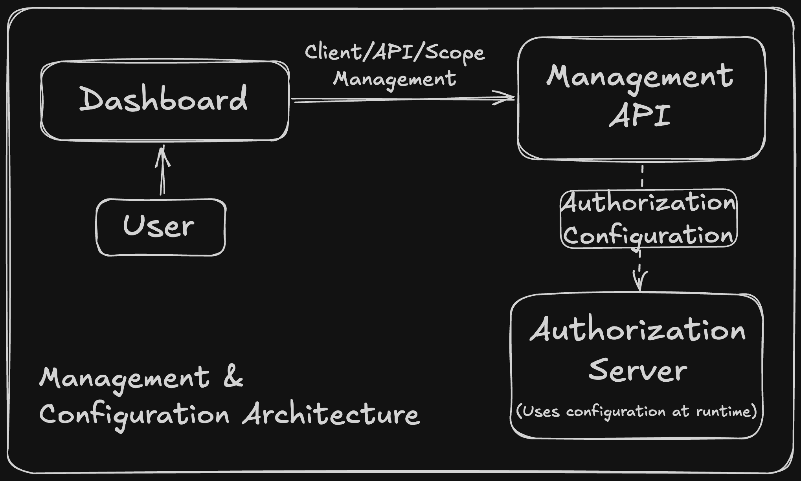
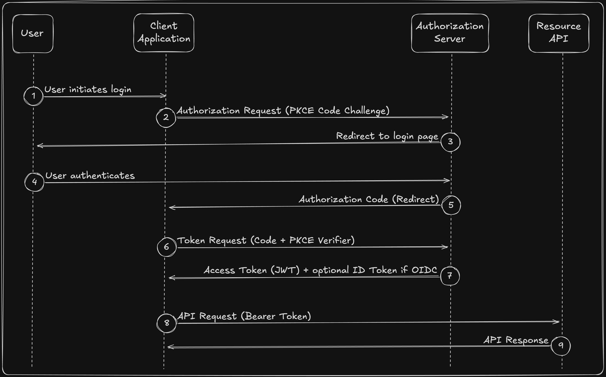

# OpenAuth

OpenAuth is a custom OAuth2 / OpenID Connect provider built with ASP.NET Core and a React dashboard for managing applications, API resources, and permissions.

It currently supports Authorization Code with PKCE and Client Credentials, and focuses on modeling real authorization concepts like clients, scopes, API resources, and token issuance rather than only reproducing a basic login demo.


## Why

The goal of the project was not only to implement OAuth flows, but to build a system that reflects real-world identity and access management concerns, including API authorization, application management, and secure token validation.

Instead of treating authentication as a black box, this project explores how authorization servers model clients, APIs, and permissions, and how those concepts propagate through authorization flows and token issuance.

The system is inspired by Auth0 and aims to resemble a simplified, self-hosted alternative, focusing on explicit domain modeling of clients, API resources, scopes, and their role in authorization flows and token generation.


## Features

- Authorization Code Flow with PKCE
- Client Credentials Flow
- JWT access tokens (RS256) with JWKS endpoint for validation or HS256

- Explicit modeling of:
  - Clients (applications)
  - API Resources
  - Permissions (scopes)
  - Client ↔ API access relationships

- Dynamic client authorization:
  - Assign APIs to clients
  - Configure allowed scopes per API

- React dashboard for:
  - Managing applications and APIs
  - Configuring API access
  - Assigning permissions


## Architecture

OpenAuth is composed of several key components that work together to handle authentication, authorization, and application management.

### Components

- Authorization Server (ASP.NET Core)
  - Handles OAuth2 / OIDC flows
  - Issues JWT access tokens
  - Exposes endpoints such as `/connect/authorize`, `/connect/token`, and `/jwks`

- Management Component  
	- Handles configuration of clients, API resources, and scopes  
	- Defines what access is allowed during authorization and token issuance

- React Dashboard
  - UI for managing applications and API access
  - Interacts with management endpoints

- Clients (Applications)
  - External applications requesting tokens

- Resource APIs
  - Protected APIs that validate access tokens and enforce scopes

The system models authorization explicitly through relationships between clients, API resources, and scopes, allowing fine-grained control over which applications can access which APIs and with what permissions.

<p align="center">  
	  
</p>

<p align="center">  
	  
</p>

### Interaction Overview

1. A client redirects the user to the authorization server
2. The user authenticates and grants access
3. The authorization server issues a token
4. The client uses the token to call protected APIs
5. APIs validate the token using the JWKS endpoint

## Example Flow (Authorization Code + PKCE)

The following describes how a client obtains an access token using the Authorization Code flow with PKCE.

<p align="center">  
	  
</p>

1. The client application redirects the user to the authorization endpoint (`/connect/authorize`) with the requested scopes and a PKCE code challenge.

2. The user authenticates with the authorization server.  
   (A consent step for approving requested scopes is not currently implemented.)

3. Upon successful authentication, the authorization server issues an authorization code and redirects the user back to the client with the requested scopes applied.

5. The client exchanges the authorization code at the token endpoint (`/connect/token`) by providing the PKCE code verifier.

6. The authorization server validates the request and issues a signed JWT access token containing the approved scopes and audience.  
If the `openid` scope is included, an ID token is also issued, providing identity information about the authenticated user.

7. The client uses the access token to call protected APIs.

8. The API validates the token using the JWKS endpoint and enforces access based on scopes.

The issued token reflects the configured relationship between the client, the target API resource, and the allowed scopes.


## Design Decisions

### Explicit API Resource Modeling

Instead of treating audiences and scopes as simple strings, the system models API resources as first-class entities with associated permissions.

This allows clients to be authorized against specific APIs with fine-grained control over allowed scopes, rather than relying on loosely structured scope strings.

### Client ↔ API Authorization Model

Authorization is modeled explicitly through relationships between clients and API resources, with allowed scopes defined per relationship.

This makes access rules transparent and easier to manage, and ensures that tokens are issued based on clearly defined permissions.

### Token Signing Strategy

Tokens are issued using signed JWTs (RS256), with support for pluggable signing algorithms through an abstraction over signing credentials.

This allows the system to evolve to support different cryptographic strategies without changing the token issuance pipeline.

### Separation of Configuration and Runtime Behavior

The system separates management concerns (clients, APIs, permissions) from runtime authorization flows.

This reflects how real-world identity systems operate, where configuration defines how tokens are issued rather than being embedded directly in flow logic.


## Getting Started

### Running locally

```bash
# Backend
cd apps/server
dotnet run

# Dashboard
cd apps/dashboard
npm install
npm run dev
```

> Note: The project currently requires manual setup. Docker support and pre-seeded demo data are planned to streamline onboarding.

### Planned Improvements
- Docker support for simplified setup  
- Seed data for demo clients, APIs, and scopes  
- One-command startup for full system


## Project Structure  
  
- `apps/server/`  
OAuth2 / OpenID Connect authorization server  
Handles authorization flows, token issuance, and validation  
  
- `apps/dashboard/`  
React-based management UI  
Used to configure clients, API resources, and permissions  
  
- `docs/` (optional)  
Additional documentation such as architecture and flows

The project is organized around two main concerns: runtime authorization and management of configuration.


## Future Improvements

### Developer Experience
  
- Docker-based setup for one-command startup
- Seeded demo data for clients, API resources, and scopes
- Improved demo applications to better showcase supported flows
  
### Security & OAuth Features

- Authentication and access control for the management dashboard
- Refresh token support for long-lived sessions
- User consent screen for approving requested scopes during authorization
- Signing key rotation with multiple active keys in JWKS
- Configurable CORS policies per client
- Rate limiting on sensitive endpoints (e.g. `/token`, `/authorize`)
  
### Platform Capabilities
  
- Multi-tenancy support to enable public hosting scenarios
